# Plant Geek

## Description

Plant Geek is an open-source solution for managing your indoor garden using a fridge. This system allows you to fully control environmental parameters such as temperature, humidity, and CO2 levels. Additionally, you can control the lighting and set up daylight schedules.

**The system is in active development.**

If you have any questions, please open an issue ticket.

You can support the project:

[](https://www.buymeacoffee.com/plantgeek)


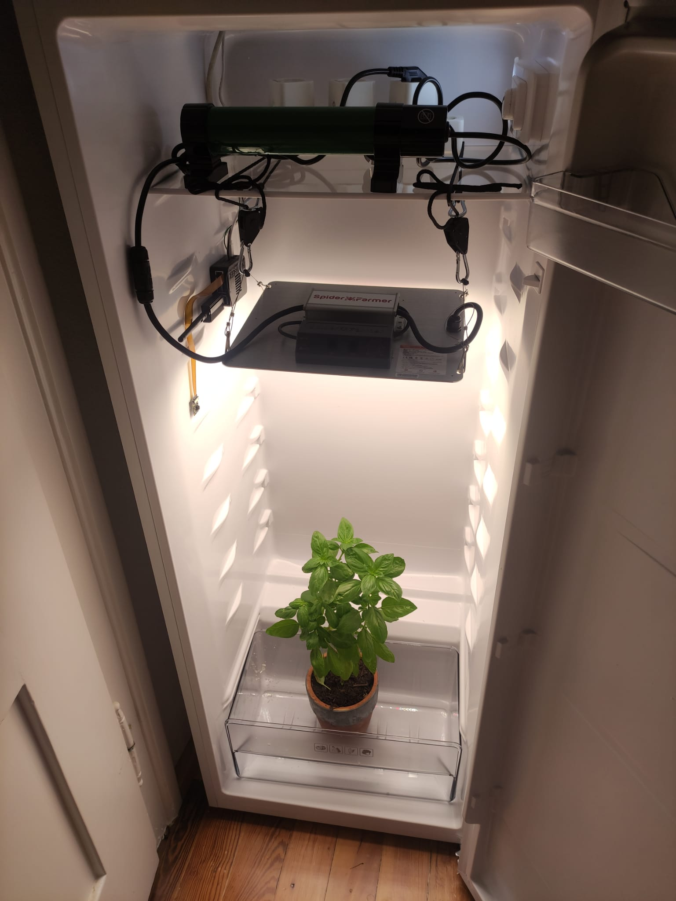


### Frontend:


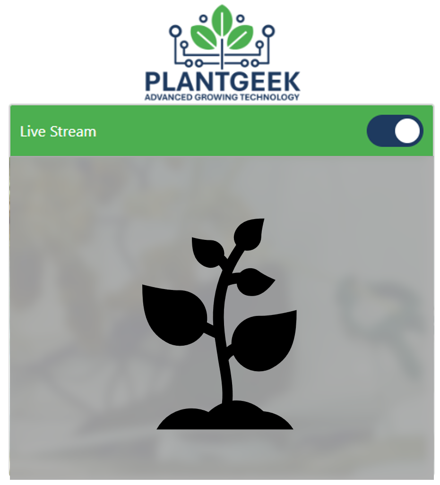

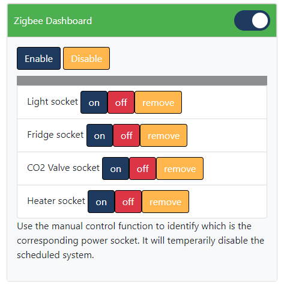

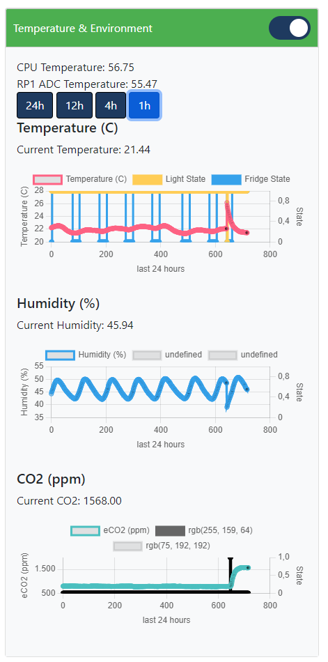

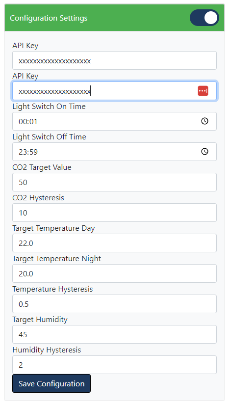


## Installation

### Installing the Raspberry Pi Image
Follow these instructions to install a basic Raspberry Pi image:

1. Download the Raspberry Pi Imager.
2. Install the image onto your SD card.

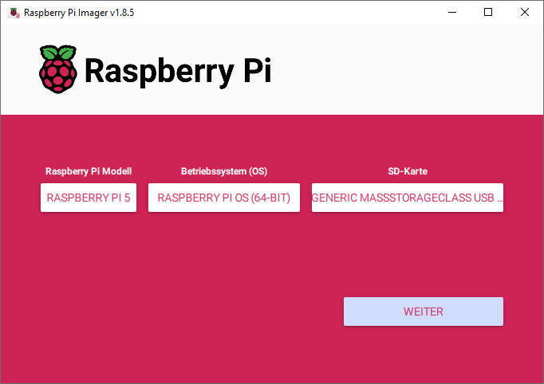

3. It is recommended to set up your Wi-Fi connection during installation. This way, you won't need to connect a screen, keyboard, etc.

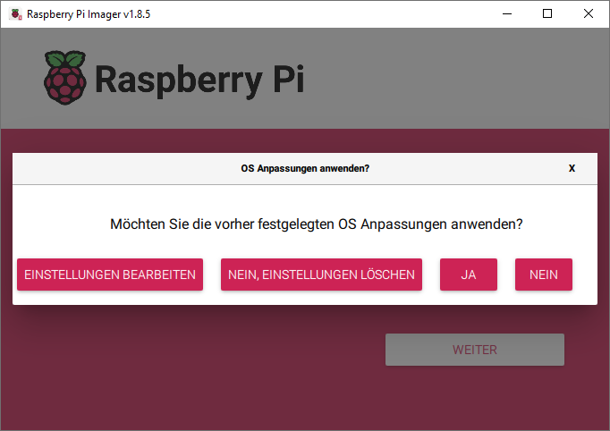
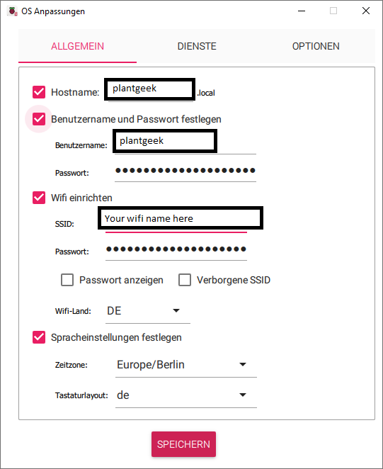

4. Activate SSH access using a password.

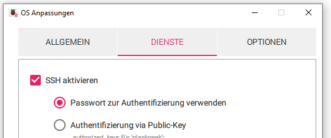

5. Insert the SD card into your Raspberry Pi.

### Sensor Connection

#### Environment Sensor
Currently, the SCD4x Sensor is supported. Connect the sensor to the Raspberry Pi as shown in the image below:

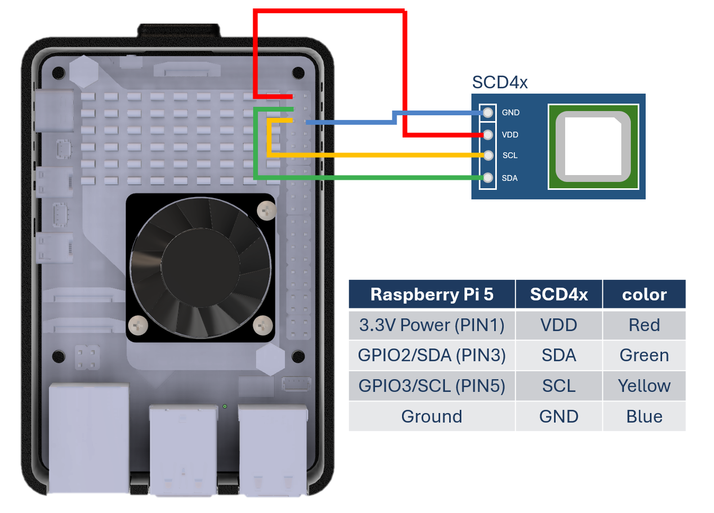

**Note:** The SCD41 is tested and recommended. The SCD40 is being evaluated for future use (it is a cheaper version with less accuracy).

The DHT22 is also supported by enabling it in the `app.py` file manually. However, it is not recommended as the system in a closed environment requires active CO2 control, which is not possible with the DHT22.

#### Camera
Connect a camera using the CSI interface. Use the Cam/Disp0 interface port on your Raspberry Pi.

**Note:** Support for USB cameras is discontinued due to reliability issues.

### Zigbee Gateway Connection
Plug in your Zigbee USB stick. We recommend the Zonoff Zigbee bridge.

**Note:** We are currently testing the Zigbee bridge from Cobee. You may also try this one.

**Congrats, we are done setting up the hardware of our Raspberry Pi.**

### Software Installation

1. Connect your Raspberry Pi to its power supply.
2. Give the Raspberry Pi about 3 minutes to boot up, then log in via SSH.

Open a PowerShell terminal and type:
```bash
ssh plantgeek@plantgeek
```
After a successful login, you should see a screen like this:

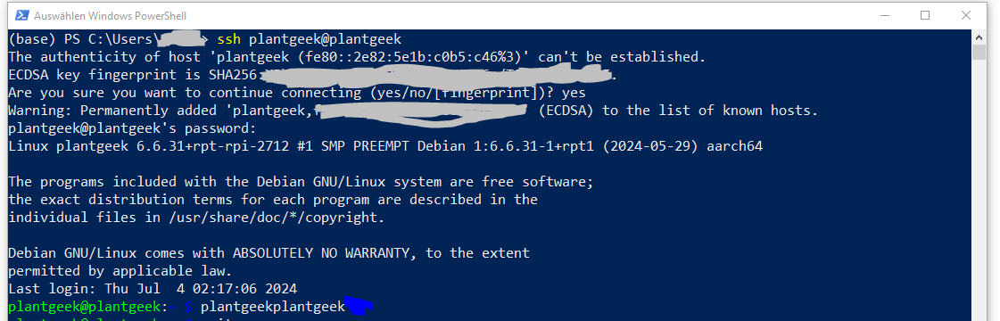

3. Install the software from GitHub.

Clone the repository:
```bash
mkdir plantgeek
cd plantgeek
git clone https://github.com/MathiasPechinger/plantgeek.git .
```

Set up the system (this takes about 7-8 minutes on a Raspberry Pi 5):
```bash
./setup.sh
```

you can login to your browser, which is connected to your local network by entering:
```
plantgeek:5000
```

The rest of the setup, such as connecting the Zigbee socket, can be done in the frontend.

### Installation FAQ

#### Troubleshooting
1. You can check if the system is running correctly by checking the services.
```
sudo systemctl status drowbox_webapp.service
```
Note: this is an old name of the system so don't worry, it will be changed in to future.

2. You can execute the webapp manually to see comandline outputs
Stop the current service
```
sudo systemctl stop drowbox_webapp.service
```
Source the environment and start the application
```
source venv/bin/activate
python app.py
```


#### Other Platforms
If you are using a platform with less than 4GB of RAM, consider increasing the swap. The system should run on older versions of Raspberry Pi or even a Pi Zero 2W, although the installation may take longer and is not thoroughly tested.

To increase the swap (Pi Zero 2W):
```bash
sudo nano /etc/dphys-swapfile
```
Change the following line:
```plaintext
CONF_SWAPSIZE=1024
```

#### Setup conbee 3
You can use the conbee 3 gateway by modifying the zigebee configuration yaml and adding there two line:

```
  adapter: deconz
  baudrate: 115200
```

You may also need to update the firmware of the conbee 3 gateway.

For more information check this issue:
https://github.com/Koenkk/zigbee2mqtt/issues/19955


#### Setup of Older Raspberry Pi Cameras (e.g., IMX219)

```bash
sudo nano /boot/firmware/config.txt 
```
##### imx219

Find the line `camera_auto_detect=1` and update it to:
```plaintext
camera_auto_detect=0
```
Find the line `[all]` and add the following item under it:
```plaintext
dtoverlay=imx219,cam0
```
Save and reboot.

##### ov 5647
#Find the line: camera_auto_detect=1, update it to:
camera_auto_detect=0
#Find the line: [all], add the following item under it:
dtoverlay=ov5647

Source: [ArduCam Documentation](https://docs.arducam.com/Raspberry-Pi-Camera/Native-camera/8MP-IMX219/)
